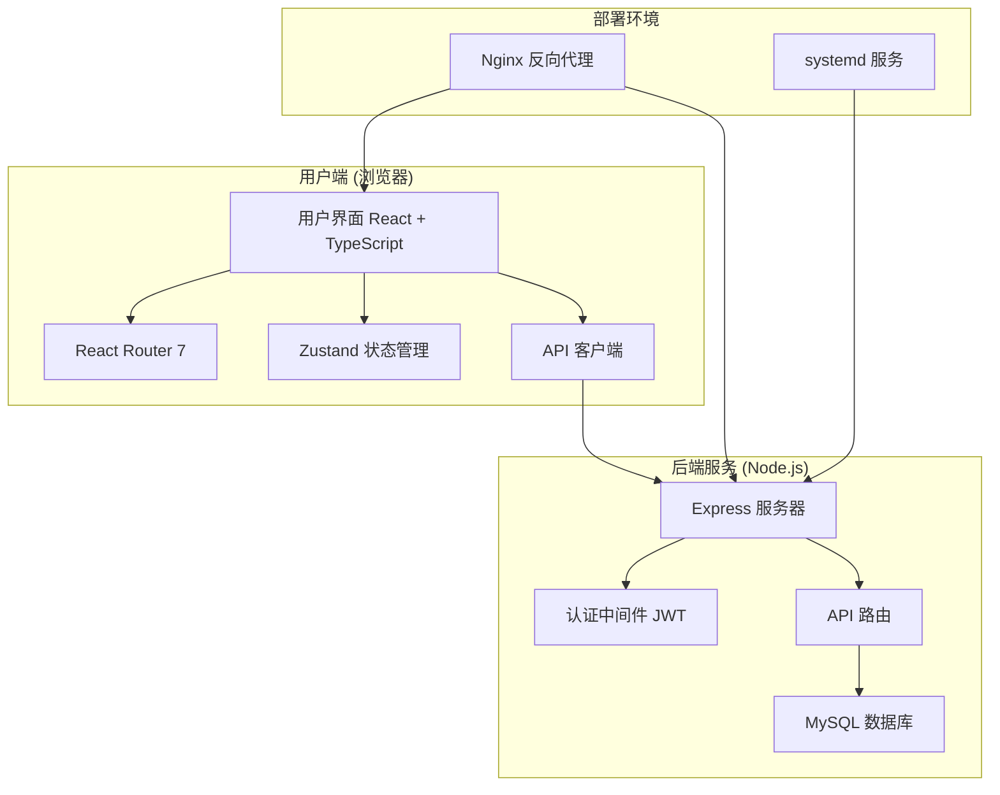
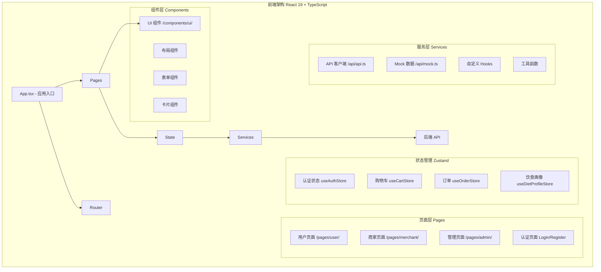
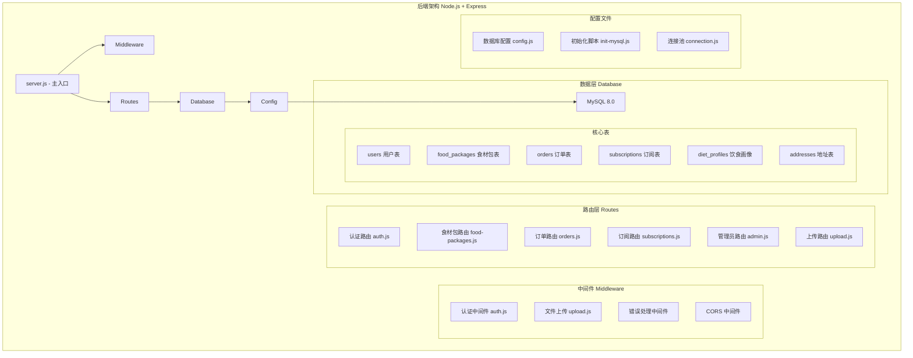
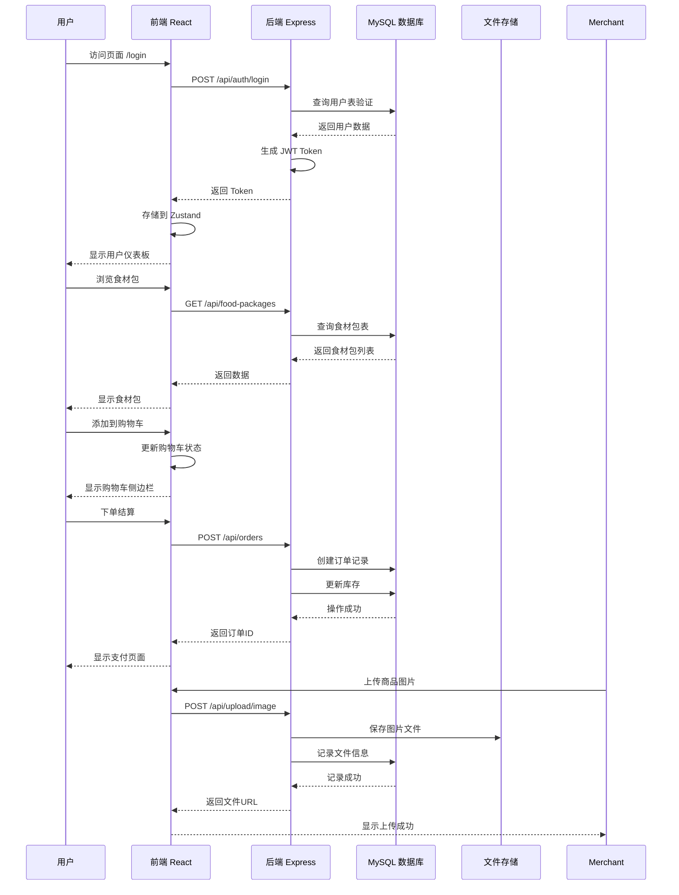
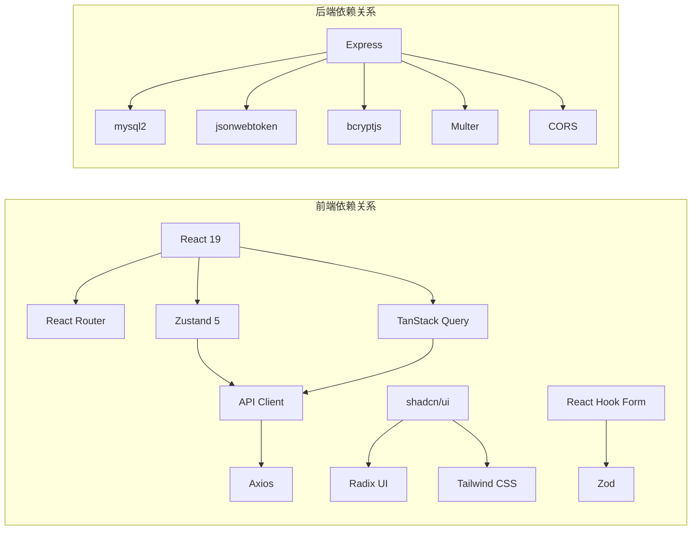
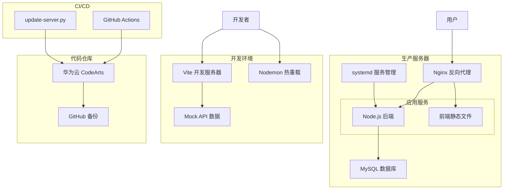

# 食材包订阅平台 - 架构示意图

## 整体架构概览



## 前端架构 (frontend-src/)



## 后端架构 (backend/)



## 数据流示意图



## 目录结构树

```
food-subscription-v01.1-backup/
├── backend/                          # Node.js 后端
│   ├── db/                          # 数据库配置
│   │   ├── config.js                # 数据库连接配置
│   │   ├── connection.js            # 连接池管理
│   │   └── init-mysql.js            # 数据库初始化脚本
│   ├── middleware/                  # 中间件
│   │   ├── auth.js                  # JWT 认证中间件
│   │   └── upload.js                # 文件上传中间件
│   ├── routes/                      # API 路由
│   │   ├── auth.js                  # 认证相关接口
│   │   ├── food-packages.js         # 食材包 CRUD
│   │   ├── orders.js                # 订单处理
│   │   ├── subscriptions.js         # 订阅管理
│   │   ├── diet-profile.js          # 饮食画像
│   │   ├── addresses.js             # 收货地址
│   │   ├── upload.js                # 文件上传
│   │   └── admin.js                 # 管理员接口
│   ├── uploads/                     # 上传文件存储
│   └── server.js                    # Express 主入口
│
├── frontend-src/                    # React 前端源码
│   ├── src/
│   │   ├── api/                     # API 客户端
│   │   │   ├── api.ts               # 真实 API 调用
│   │   │   └── mock.ts              # Mock 数据 (开发用)
│   │   ├── components/              # 组件库
│   │   │   └── ui/                  # shadcn/ui 组件 (50+)
│   │   ├── pages/                   # 页面组件
│   │   │   ├── admin/               # 管理端页面
│   │   │   ├── merchant/            # 商家端页面
│   │   │   ├── user/                # 用户端页面
│   │   │   ├── Login.tsx            # 登录页
│   │   │   └── Register.tsx         # 注册页
│   │   ├── store/                   # Zustand 状态管理
│   │   │   └── index.ts             # 所有状态存储
│   │   ├── types/                   # TypeScript 类型
│   │   │   └── index.ts             # 类型定义
│   │   ├── hooks/                   # 自定义 React Hooks
│   │   └── lib/                     # 工具函数
│   ├── public/                      # 静态资源
│   └── dist/                        # 构建输出
│
├── frontend/                        # 生产构建 (Nginx 服务)
│   └── dist/
│
├── nginx/                           # Nginx 配置
│   └── food-subscription.conf
│
└── 部署脚本/
    ├── deploy.sh                    # 一键部署
    ├── v1_2.sh                      # v1.2 部署脚本
    ├── update-server.py             # 服务器更新脚本
    └── fix-line-endings.py          # 跨平台行尾修正
```

## 组件依赖关系



## 部署架构



## 技术栈矩阵

| 层 | 技术 | 版本 | 用途 |
|----|------|------|------|
| **前端** | React | 19.2.0 | UI 框架 |
| | TypeScript | 5.9.3 | 类型安全 |
| | Vite | 7.2.4 | 构建工具 |
| | Tailwind CSS | 3.4.19 | 原子化样式 |
| | shadcn/ui | - | UI 组件库 |
| | Zustand | 5.0.11 | 状态管理 |
| | TanStack Query | 5.90.20 | 服务端状态 |
| | React Hook Form | 7.70.0 | 表单处理 |
| | Zod | 4.3.5 | 数据验证 |
| **后端** | Node.js | 18+ | 运行时 |
| | Express | 4.18.2 | Web 框架 |
| | MySQL | 8.0+ | 数据库 |
| | mysql2 | 3.6.5 | 数据库驱动 |
| | JWT | 9.0.2 | 认证 |
| | bcryptjs | 2.4.3 | 密码加密 |
| | Multer | 1.4.5 | 文件上传 |
| **部署** | Nginx | - | 反向代理 |
| | systemd | - | 进程管理 |
| | PM2 | - | Node 进程管理 |
| **开发** | ESLint | - | 代码检查 |
| | Git | - | 版本控制 |
| | GitHub Actions | - | CI/CD |

---

*示意图生成时间: 2026-03-08*
*项目版本: food-subscription-v01.1-backup*
*更新状态: 文档已更新并推送至 CodeArts 仓库*